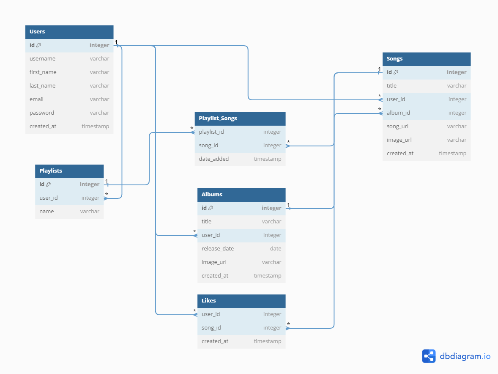

# Amplify

[Amplify](https://amplify-group.onrender.com/) is a digital platform for music, inspired by [Spotify](https://open.spotify.com/?).

## Installation guide

### Clone the repo
  * run `git clone https://github.com/an-ngo-1427/Amplify.git` in a desired directory

### Install dependencies
  * run `pipenv install -r requirements.txt` in the root project folder
  * run `npm install` in `react-vite` folder

### Create and ensure that the .env file has the following fields
(You will need to create an AWS S3 Bucket)
  * SECRET_KEY
  * DATABASE_URL
  * SCHEMA
  * S3_BUCKET
  * S3_KEY
  * S3_SECRET

### Migration
  * run `pipenv shell flask db upgrade` in the root project folder

### Optional seedings
  * run `pipenv shell flask seed reset` in the root project folder

### Start up the servers
  * run `pipenv shell flask run` in the root project folder
  * run `npm run dev` in `react-vite` folder

## Contact Us
[](https://www.linkedin.com/in/an-ngo-79a07a122/)


[](https://www.linkedin.com/in/christopher-fealy/)


[](https://www.linkedin.com/in/dennis-ma-621ba2226/)


[](https://www.linkedin.com/in/gary-k-cheung/)


## Technologies Used


## Database Schema Design


## API Documentation

## USER AUTHENTICATION/AUTHORIZATION

### All endpoints that require authentication

All endpoints that require a current user to be logged in.

* Request: endpoints that require authentication
* Error Response: Require authentication
  * Status Code: 401
  * Headers:
    * Content-Type: application/json
  * Body:

    ```json
    {
      "message": "Authentication required"
    }
    ```

### All endpoints that require proper authorization

All endpoints that require authentication and the current user does not have the
correct role(s) or permission(s).

* Request: endpoints that require proper authorization
* Error Response: Require proper authorization
  * Status Code: 403
  * Headers:
    * Content-Type: application/json
  * Body:

    ```json
    {
      "message": "Forbidden"
    }
    ```

### Get the Current User

Returns the information about the current user that is logged in.

* Require Authentication: false
* Request
  * Method: GET
  * URL: /api/session
  * Body: none

* Successful Response when there is a logged in user
  * Status Code: 200
  * Headers:
    * Content-Type: application/json
  * Body:

    ```json
    {
      "user": {
        "id": 1,
        "firstName": "John",
        "lastName": "Smith",
        "email": "john.smith@gmail.com",
        "username": "JohnSmith"
      }
    }
    ```

* Successful Response when there is no logged in user
  * Status Code: 200
  * Headers:
    * Content-Type: application/json
  * Body:

    ```json
    {
      "user": null
    }
    ```

### Log In a User

Logs in a current user with valid credentials and returns the current user's
information.

* Require Authentication: false
* Request
  * Method: POST
  * URL: /api/session
  * Headers:
    * Content-Type: application/json
  * Body:

    ```json
    {
      "credential": "john.smith@gmail.com",
      "password": "secret password"
    }
    ```

* Successful Response
  * Status Code: 200
  * Headers:
    * Content-Type: application/json
  * Body:

    ```json
    {
      "user": {
        "id": 1,
        "firstName": "John",
        "lastName": "Smith",
        "email": "john.smith@gmail.com",
        "username": "JohnSmith"
      }
    }
    ```

* Error Response: Invalid credentials
  * Status Code: 401
  * Headers:
    * Content-Type: application/json
  * Body:

    ```json
    {
      "message": "Invalid credentials"
    }
    ```

* Error response: Body validation errors
  * Status Code: 400
  * Headers:
    * Content-Type: application/json
  * Body:

    ```json
    {
      "message": "Bad Request",
      "errors": {
        "credential": "Email or username is required",
        "password": "Password is required"
      }
    }
    ```

### Sign Up a User

Creates a new user, logs them in as the current user, and returns the current
user's information.

* Require Authentication: false
* Request
  * Method: POST
  * URL: /api/users
  * Headers:
    * Content-Type: application/json
  * Body:

    ```json
    {
      "firstName": "John",
      "lastName": "Smith",
      "email": "john.smith@gmail.com",
      "username": "JohnSmith",
      "password": "secret password"
    }
    ```

* Successful Response
  * Status Code: 200
  * Headers:
    * Content-Type: application/json
  * Body:

    ```json
    {
      "user": {
        "id": 1,
        "firstName": "John",
        "lastName": "Smith",
        "email": "john.smith@gmail.com",
        "username": "JohnSmith"
      }
    }
    ```

* Error response: User already exists with the specified email
  * Status Code: 500
  * Headers:
    * Content-Type: application/json
  * Body:

    ```json
    {
      "message": "User already exists",
      "errors": {
        "email": "User with that email already exists"
      }
    }
    ```

* Error response: User already exists with the specified username
  * Status Code: 500
  * Headers:
    * Content-Type: application/json
  * Body:

    ```json
    {
      "message": "User already exists",
      "errors": {
        "username": "User with that username already exists"
      }
    }
    ```

* Error response: Body validation errors
  * Status Code: 400
  * Headers:
    * Content-Type: application/json
  * Body:

    ```json
    {
      "message": "Bad Request",
      "errors": {
        "email": "Invalid email",
        "username": "Username is required",
        "firstName": "First Name is required",
        "lastName": "Last Name is required"
      }
    }
    ```

## SONGS
- ### GET /api/songs
    _Users should be able to view all Songs._
    - required auth: False
    - Unauthorized and authorized users should be able to view all songs sorted by likes
        - **Request**
            - Method: GET
            - URL: /api/songs
            - Body: none
        - **Successful Response**
            ```json
            {
                "songs":[
                    {
                        "id": 1,
                        "title": "Song Title",
                        "user_id": 1,
                        "song_url": "songurl.com",
                        "image_url": "imageurl.com",
                        "likes": 0,
                        "user_likes": [],
                        "created_at": "2021-11-19 20:39:36",
                        "updated_at": "2021-11-19 20:39:36",
                        "artist": {
                            "id": 1,
                            "username": "DemoUser",
                            "email": "demo@user.io",
                            "first_name": "Demo",
                            "last_name": "User"
                        },
                        "album_id": 1,
                    }
                ]
            }
            ```

- ### POST /api/songs
    _Users should be able to upload songs._
    - Required Auth: True
    - Only logined user can add a song
        - **Request**
            - Method: POST
            - URL: /api/songs
            - Body:
                ```json
                {
                    "title": "Song Title",
                    "audio": "song.mp3"
                }
                ```
        - **Successful Response** (code 201)
            ```json
            {
                "id": 1,
                "title": "Song Title",
                "user_id": 1,
                "song_url": "songurl.com",
                "image_url": "imageurl.com",
                "likes": 0,
                "user_likes": [],
                "created_at": "2021-11-19 20:39:36",
                "updated_at": "2021-11-19 20:39:36",
                "artist": {
                    "id": 1,
                    "username": "DemoUser",
                    "email": "demo@user.io",
                    "first_name": "Demo",
                    "last_name": "User"
                },
                "album_id": 1,
            }
            ```
        - **Error Response** (code 401)
            ```json
            {
                "message": "Bad Request",
                "errors": {
                    "title": "Title is required",
                    "audio": "Audio is required"
                }
            }
            ```
- ### PUT /api/songs/:songId
    _Users should be able to update their uploaded songs._
    - Required Auth:True
    - **Request**
        - Method: POST
        - URL: /api/songs/:songId
        - Body:
            ```json
            {
                "title": "Song Title",
                "audio": "song.mp3",
                "image": "image.jpg",
            }
            ```
    - **Successful Response** (code 200)
        ```json
        {
            "id": 1,
            "title": "Song Title",
            "user_id": 1,
            "song_url": "songurl.com",
            "image_url": "imageurl.com",
            "likes": 0,
            "user_likes": [],
            "created_at": "2021-11-19 20:39:36",
            "updated_at": "2021-11-19 20:39:36",
            "artist": {
                "id": 1,
                "username": "DemoUser",
                "email": "demo@user.io",
                "first_name": "Demo",
                "last_name": "User"
            },
            "album_id": 1,
        }
        ```
    - **Error Response**
        - User not authorized (code 403)
            ```json
            {
                "message": "Forbidden"
            }
            ```
        - Song couldnt be found (code 404)
            ```json
            {
                "Error": "Song could not be found"
            }
            ```
        - Missing info (code 401)
            ```json
            {
                "message": "Bad Request",
                "errors": {
                    "title": "Title is required"
                }
            }
            ```
- ### GET /api/songs/:songId
    _User is able to get details of a song by specified ID_
    - Required Auth: False
    - **Request**
        - Method: GET
        - URL: /api/songs/:songId
        - Body:none
    - **Successful Response**
        ```json
        {
            "id": 1,
            "title": "Song Title",
            "user_id": 1,
            "song_url": "songurl.com",
            "image_url": "imageurl.com",
            "likes": 0,
            "user_likes": [],
            "created_at": "2021-11-19 20:39:36",
            "updated_at": "2021-11-19 20:39:36",
            "artist": {
                "id": 1,
                "username": "DemoUser",
                "email": "demo@user.io",
                "first_name": "Demo",
                "last_name": "User"
            },
            "album_id": 1,
        }
        ```
    - **Error Response**
        ```json
        {
            "message":"Song not found"
        }
        ```
- ### DELETE /songs/:songId
    _Users should be able to delete their uploaded songs._
    - Required Auth: True
    - **Request**
        - Method: DELETE
        - URL: /songs/:songId
        - Body: none
    - **Successful Response**
        ```json
        {
            "message": "Successfully deleted song"
        }
        ```
    - **Error Response**
        - Song could not be found
        ```json
        {
            "errors": "Song could not be found"
        }
        ```
        - Unauthorized user
        ```json
        {
            "message": "Forbidden"
        }
        ```

## ALBUMS
- ### GET /api/albums
    _Users should be able to view all albums created by users._
    - Required Auth: True
    - **Request**
        - Method: GET
        - URL: /api/albums
        - Body: none
    - **Successful Response**
        ```json
        {
            "albums":[
                {
                    "id": 1,
                    "user_id": 1,
                    "title": "Album Title",
                    "image_url": "imageurl.com",
                    "created_at": "Sun, 25 Feb 2024 20:33:49 GMT",
                    "updated_at": "Sun, 25 Feb 2024 20:33:49 GMT",
                    "songs": [
                        {
                            "id": 1,
                            "title": "Song Title",
                            "user_id": 1,
                            "song_url": "songurl.com",
                            "image_url": "imageurl.com",
                            "likes": 0,
                            "user_likes": [],
                            "created_at": "2021-11-19 20:39:36",
                            "updated_at": "2021-11-19 20:39:36",
                            "artist": {
                                "id": 1,
                                "username": "DemoUser",
                                "email": "demo@user.io",
                                "first_name": "Demo",
                                "last_name": "User"
                            },
                            "album_id": 1,
                        }
                    ],
                    "artist": {
                        "id": 1,
                        "username": "DemoUser",
                        "email": "demo@user.io",
                        "first_name": "Demo",
                        "last_name": "User"
                    },
                    "album_id": 1
                }
            ]
        }
        ```
- ### GET /api/albums/:albumId
    _Users should be able to get album details_
    - Required Auth: False
    - **Response**
        - Method: GET
        - URL: /api/albums/:albumId
        - Body: none
    - **Succressful Response**
        ```json
        {
            "id": 1,
            "user_id": 1,
            "title": "Album Title",
            "image_url": "imageurl.com",
            "created_at": "Sun, 25 Feb 2024 20:33:49 GMT",
            "updated_at": "Sun, 25 Feb 2024 20:33:49 GMT",
            "songs": [
                {
                    "id": 1,
                    "title": "Song Title",
                    "user_id": 1,
                    "song_url": "songurl.com",
                    "image_url": "imageurl.com",
                    "likes": 0,
                    "user_likes": [],
                    "created_at": "2021-11-19 20:39:36",
                    "updated_at": "2021-11-19 20:39:36",
                    "artist": {
                        "id": 1,
                        "username": "DemoUser",
                        "email": "demo@user.io",
                        "first_name": "Demo",
                        "last_name": "User"
                    },
                    "album_id": 1,
                }
            ],
            "artist": {
                "id": 1,
                "username": "DemoUser",
                "email": "demo@user.io",
                "first_name": "Demo",
                "last_name": "User"
            },
            "album_id": 1
        }
        ```
- ### POST /api/albums/:albumId/songs
    _Users should be able to add songs to an album they created._
    - Required Auth: True
    - **Request**
        - Method: POST
        - URL: /api/albums/:albumId/songs
        - Body:
            ```json
            {
                "song_id": 1
            }
            ```
    - **Successful Response**
        ```json
        {
            "id": 1,
            "user_id": 1,
            "title": "Album Title",
            "image_url": "imageurl.com",
            "created_at": "Sun, 25 Feb 2024 20:33:49 GMT",
            "updated_at": "Sun, 25 Feb 2024 20:33:49 GMT",
            "songs": [
                {
                    "id": 1,
                    "title": "Song Title",
                    "user_id": 1,
                    "song_url": "songurl.com",
                    "image_url": "imageurl.com",
                    "likes": 0,
                    "user_likes": [],
                    "created_at": "2021-11-19 20:39:36",
                    "updated_at": "2021-11-19 20:39:36",
                    "artist": {
                        "id": 1,
                        "username": "DemoUser",
                        "email": "demo@user.io",
                        "first_name": "Demo",
                        "last_name": "User"
                    },
                    "album_id": 1,
                }
            ],
            "artist": {
                "id": 1,
                "username": "DemoUser",
                "email": "demo@user.io",
                "first_name": "Demo",
                "last_name": "User"
            },
            "album_id": 1
        }
        ```
- ### DELETE /api/albums/:albumId/songs/:songId
    _Users should be able to remove songs from their albums._
    - Required Auth: True
    - **Request**
        - Method: DELETE
        - URL: /api/albums/:albumId/songs/:songId
        - Body: none
    - **Successful Resposne**
        ```json
        {
            "message": "Successfully Deleted song"
        }
        ```
    - **Err Response**
        - User not authorized
         ```json
        {
            "message": "Forbidden"
        }
        ```
        - Song not found
        ```json
        {
            "errors": "Song could not be found"
        }
        ```
- ### DELETE /api/albums/:albumId
    _Users should be able to delete their albums._
    - Required Auth: True
    - **Request**
        - Method: DELETE
        - URL: /api/albums/:albumId
        - Body: none
    - **Successful Response**
        ```json
        {
            "message": "Successfully Deleted Album"
        }
        ```
    - **Err Response**
        - User not authorized
        ```json
        {
            "message":"Forbidden"
        }
        ```
        - Album not found
        ```json
        {
            "error":"Album cound not be found"
        }
        ```
## LIKES

- ### GET /api/songs/:songId/likes
    _Users should be able to view the likes on a song._
    - Required Auth: False
    - **Request**
        - Method: GET
        - URL: /api/songs/:songId/likes
        - Body: none
    - **Successful Response**
        ```json
        {

        }
        ```
- ### POST /api/songs/:songId/likes
    _Users should be able to like a song._
    - Required Auth: True
    - **Request**
        - Method: POST
        - URL: /api/songs/:songId/likes
    - **Successful Response**
        ```json
        {
            "message":"successfully liked song"
        }
        ```
- ### DELETE /api/songs/:songId/likes/:likeId
    _Users should be able to unlike a song._
    - Required Auth: True
    - **Request**
        - Method: DELETE
        - URL: /api/songs/:songId/likes/:likeId
        - Body: none
    - **Successful Response**
        ```json
        {
            "message":"Successfully unliked song"
        }
        ```

## Playlists

- ### GET /playlists
    _Users should be able to view all of their playlists._
    - Required Auth:True
    - **Request**
        - Method: GET
        - URL: /playlists
        - body:none
    - **Successfull Response**
        ```json
    {
        "playlists":[
            {
                "id": 1,
                "user_id": 1,
                "title": "Playlist Title",
                "description": "Playlist Description",
                "image_url": "playlistimageurl.com",
                "created_at": "",
                "updated_at": "",
                "songs": [
                    {
                        "id": 1,
                        "title": "Song Title",
                        "user_id": 1,
                        "song_url": "songurl.com",
                        "image_url": "imageurl.com",
                        "likes": 0,
                        "user_likes": [],
                        "created_at": "2021-11-19 20:39:36",
                        "updated_at": "2021-11-19 20:39:36",
                        "artist": {
                            "id": 1,
                            "username": "DemoUser",
                            "email": "demo@user.io",
                            "first_name": "Demo",
                            "last_name": "User"
                        },
                        "album_id": 1,
                    }
                ],
            }
        ]
    }
        ```
- ### GET /playlists/:playlistId
    _User should be able to view details of their playlist by ID_
    - Required Auth:True
    - **Request**
        - Method: GET
        - URL: /playlists/:playlistId
        - Body: none
    - **Successfull Response**
        ```json
        {
            "id": 1,
            "user_id": 1,
            "title": "Playlist Title",
            "description": "Playlist Description",
            "image_url": "playlistimageurl.com",
            "created_at": "Sun, 25 Feb 2024 20:33:49 GMT",
            "updated_at": "Sun, 25 Feb 2024 20:33:49 GMT",
            "songs": [
                {
                    "id": 1,
                    "title": "Song Title",
                    "user_id": 1,
                    "song_url": "songurl.com",
                    "image_url": "imageurl.com",
                    "likes": 0,
                    "user_likes": [],
                    "created_at": "2021-11-19 20:39:36",
                    "updated_at": "2021-11-19 20:39:36",
                    "artist": {
                        "id": 1,
                        "username": "DemoUser",
                        "email": "demo@user.io",
                        "first_name": "Demo",
                        "last_name": "User"
                    },
                    "album_id": 1,
                }
            ],
        }
        ```
    - **Error Response**
        ```json
        {
            "errors":"Playlist could not be found"
        }
        ```
- ### POST /playlists/:playlistId/songs/:songId
    _Users should be able to add a song to one of their playlists._
    - Required Auth: True
    - **Request**
        - Method: POST
        - URL: /playlists/:playlistId/songs/:songId
        - Body:
            ```json
            {
                "playlist_id":*,
                "song_id":*
            }
            ```
    - **Successfull Response**
        ```json
        {
            "message":"Successfully added song to playlist"
        }
        ```
    - **Error Response**
        ```json
        {
            "errors":"Playlist could not be found"
        }
        ```
        ```json
        {
            "errors":"Song could not be found"
        }
        ```
- ### DELETE /playlists/:playlistId/songs/:songId
    _Users should be able to remove a song from a playlist._
    - Required Auth: True
    - **Request**
        - Method:DELETE
        - URL: /playlists/:playlistId/songs/:songId
        - Body: none
    - **Successfull Response**
        ```json
        {
            "message":"Successfully deleted song from playlist"
        }
        ```
        ```json
        {
            "errors":"Song could not be found in playList"
        }
        ```
